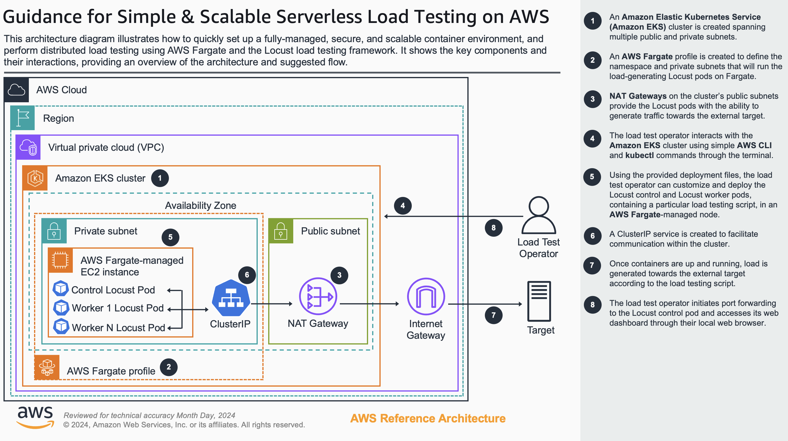

# Simple & Scalable Serverless Load Testing on AWS

## Table of Contents

- [Overview](#overview)
- [Prerequisites](#prerequisites)
- [Deployment steps](#deployment-steps)
    * [1. Creating the infrastructure with Terraform](#1-creating-the-infrastructure-with-terraform)
    * [2. Creating a Locust load testing script](#2-creating-a-locust-load-testing-script)
    * [3. Configuring the Kubernetes resource files](#3-configuring-the-kubernetes-resource-files)
        + [3a. ConfigMap deployments](#3a-configmap-deployments)
        + [3b. Custom Docker image deployments](#3b-custom-docker-image-deployments)
    * [4. Deploying the resources](#4-deploying-the-resources)
- [Deployment validation](#deployment-validation)
- [Accessing the Locust dashboard](#accessing-the-locust-dashboard)
- [Starting and stopping a test](#starting-and-stopping-a-test)
- [Increasing and decreasing load-generating worker pods](#increasing-and-decreasing-load-generating-worker-pods)
- [Cost considerations](#cost-considerations)
    * [Pricing calculator](#pricing-calculator)
    * [EKS Fargate and pod configuration costs](#eks-fargate-and-pod-configuration-costs)
    * [NAT Gateway costs](#nat-gateway-costs)
    * [Data transfer costs](#data-transfer-costs)
- [Clean up](#clean-up)

</br>

## Overview

Small and medium-sized game studios often perceive load testing as a complex and costly activity where the challenges and time investment far outweigh the benefits. Adding to that perception are solutions that are tailored towards financially sound, large enterprises and companies with dedicated load testing teams and in-house expertise. However, load testing isn’t reserved only for high-profile releases or big studios. They can provide valuable insights for studios of any size, without requiring massive budgets or infrastructure. Even modest load tests, simulating hundreds or a few thousand concurrent users can uncover performance bottlenecks, identify server scaling issues, and validate key systems.

The following solution is simple, secure, fully-managed and scalable. It is meant to introduce teams to load testing, help them run large scale tests, gain actionable insights and confidence, understand the value in the practice, and eventually grow and shape their own load testing strategy. The solution centers around [Amazon Elastic Kubernetes Service](https://aws.amazon.com/eks/), [AWS Fargate](https://aws.amazon.com/fargate/), and open-source load testing framework [Locust](https://locust.io/), and can be built upon as the team's proficiency and load testing program grows. For instance, teams can eventually take over the management of the underlying nodes to unlock further optimizations and cost savings, can add persistence layers (InfluxDB, Prometheus, Graphite, or AWS managed services), add more robust monitoring and observability layers (Grafana, New Relic, AWS CloudWatch), and even enhance alerting and notification capabilities (posting to SNS topics, sending email/SMS, posting to Slack channels).



The architecture diagram above shows an EKS cluster that could span multiple availability zones. Each availability zone could contain private and public subnets. The EKS cluster has a Fargate profile that includes all private subnets, and Fargate-managed EC2 instances are allocated within them, which contain the deployed Locust pods. There is one control pod and multiple workers, and a ClusterIP service that provides pods with internal IP addresses. The ClusterIP service allows for load balanced traffic, as well as communication between the pods in the cluster without exposing them directly to the internet. NAT Gateways provide the workloads in private subnets with the means to generate traffic towards an external endpoint. The load test operator manages the cluster and test through the terminal of their local machine, and interacts with the Locust control pod’s web dashboard via port forwarding through their local browser.

Note that while multiple availability zones provide the design with high availability and resiliency—both AWS best practices—a load testing cluster might not necessarily need it. Given their purpose and temporary nature, environment failures or test disruptions have little to no effect; they do not serve live traffic, do not interact with live user data nor impact user experience, and failed tests can be restarted. Because of this, the architecture can be refactored into having a single availability zone housing all public and private subnets, further minimizing complexity and decreasing cost.

</br>

## Prerequisites

Please take the time to install the following dependencies and to make sure you meet the following prerequisites before moving on:

- [AWS CLI](https://docs.aws.amazon.com/cli/latest/userguide/getting-started-install.html), a powerful command-line tool provided by Amazon Web Services (AWS) that allows you to interact with various AWS services directly from your computer's terminal or command prompt.
- [Terraform](https://developer.hashicorp.com/terraform/install), an open-source infrastructure as code (IaC) software tool from HashiCorp that enables users to define and provision cloud infrastructure resources in a declarative way.
- [Kubectl](https://docs.aws.amazon.com/eks/latest/userguide/install-kubectl.html), a command-line tool used to interact with and manage Kubernetes clusters.
- An IAM principal with the necessary privileges to run the provided Terraform scripts and create the resources.

</br>

## Deployment steps

</br>

### 1. Creating the infrastructure with Terraform

The following Terraform files are provided:

| Terraform File  | Purpose |
| ------------- | ------------- |
| 1-variables.tf | Defines the region, availability zones, subnets, cidr ranges, and names to be used when creating the infrastructure and resources. Should be customized to better suit your needs |
| 2-providers.tf | Specifies information about the plugins that allow Terraform to interact with different platforms, services, and infrastructure components |
| 3-vpc.tf | Creates a dedicated load testing VPC and the VPC's default security group |
| 4-subnets.tf | Outlines the public and private subnets to create |
| 5-gateways.tf | Creates the Internet Gateway, NAT Gatewaysm and Elastic IPs used |
| 6-route-tables.tf | Specifies route tables for the subnets and the approprate routes to the Internet Gatewat and NAT Gateways |
| 7-eks.tf | Creates the Amazon EKS cluster and requires components |
| 8-fargate-profile.tf | Sets up the Fargate profile that defines the namespace and private subnets that workloads are to be launched in |

Once files have been customized (if needed), open the terminal and navigate to the folder containing the terraform configuration files. Verify beforehand that calling ```aws sts get-caller-identity``` returns the IAM principal you intend to use and has the necessary permissions to build the infrastructure.

Initialize the directory with ```terraform init```. This will download and install the providers used in the files. As a best practice, verify that the configuration files are syntactically valid and internally consistent with the ```terraform validate``` command.

When ready, apply the configuration and start creating the resources via ```terraform apply```. Before applying any changes, Terraform will print out the details of the plan and the resources it intends to create, update, and destroy. Confirm by typing ```yes``` when prompted, and Terraform will start to create the resources. The process should take around 30 minutes to finish.

> [!NOTE]
> It’s possible for a timeout error to occur near the end, related to the deployment of CoreDNS pods

```
Error: waiting for EKS Add-On (load-testing-eks-cluster:coredns) create: timeout while waiting for state to become 'ACTIVE' (last state: 'DEGRADED', timeout: 20m0s)

   with aws_eks_addon.coredns,
   on 8-fargate-profile.tf line 64, in resource "aws_eks_addon" "coredns":
   64: resource "aws_eks_addon" "coredns" {
```

If encountered, simply run ```terraform apply``` again. Terraform will focus only on the resources that are missing. It will re-deploy the CoreDNS pods, and should be successful the second time after a few minutes.

</br>

### 2. Creating a Locust load testing script

Locust load testing scripts are written in [Python](https://www.python.org/), a high-level, general-purpose programming language. Locust scripts benefit from being able to define flexible scenarios that take advantage of thousands of powerful third-party libraries, while remaining familiar and easy to read.

Learning to create complex Locust scripts falls outside the scope of this guide, but the [official documentation site for Locust](https://docs.locust.io/en/stable/quickstart.html) provides detailed information and script examples to get your journey started.

For the purposes of this guide, two sample scripts are used to illustrate how to define multiple test scripts. They issue a single GET request to a relative endpoint, as the target host is specified later in the control deployment file:

```
from locust import HttpUser, task, between

class test(HttpUser):
    wait_time = between(1, 3)

    @task
    def initial_request(self):
        self.client.get("/")
```

Depending on the deployment method used, the script will be included later through a ConfigMap file, or be added into a custom Docker image. 

> [!IMPORTANT]
> A custom load testing script that accurately simulates the real-world traffic patterns and user behavior of the system being tested **must** be created and provided, as the quality and accuracy of the load testing results are heavily influenced by it.

</br>

### 3. Configuring the Kubernetes resource files 
            
The following Kubernetes resources files are provided:

| Kubernetes Resource File  | Purpose |
| ------------- | ------------- |
| namespace.yaml | Creates the namespace in the EKS cluster where the control and worker pods will be launched |
| control-deployment.yaml | Specifies the deployment configuration of and resources needed by the control pod |
| control-service.yaml | Defines the ClusterIP service to create to enable communication within the cluster |
| worker-deployment.yaml | Specifies the deployment configuration of and resources needed by the worker pods |
| configmap.yaml | (If using ConfigMap deployment) Defines the load testing script to use |
| Dockerfile | (If using custom image deployment) File describing the base Locust Docker image to use, and load testing scripts to include when creating the custom Docker image |
| script1.py / script2.py | (If using custom image deployment) Sample load testing scripts, to be replaced with custom scripts |

There are many ways to create deployments. This guide focuses on two:
- Using **ConfigMap** to provide the Pods with the Locust load testing script, and
- Building a custom **Docker image** from the base Locust image, containing multiple Locust testing scripts inside.

</br>

### 3a. ConfigMap deployments

In ConfigMap deployments, the load testing script is provided to the Locust client via a Kubernetes resource file called **ConfigMap**. This approach might be particularly useful when dealing with relatively small scripts that are frequently changing. Navigate to the ```source/kubernetes-configmap-version/``` directory in the terminal.
As seen in the ```configmap.yaml``` file, the scripts are defined as key value pairs (```script1``` and ```script2```), and multiple scripts can be added to the same ConfigMap file.

> [!IMPORTANT]
> Remember to replace the sample load testing scripts with your own in the ConfigMap, tailored specifically for the system you are testing.

The deployments files for the control and worker pods (```control-deployment.yaml``` and ```worker-deployment.yaml```) map the ConfigMap to a volume and mount the volume on the container. The key in the ConfigMap associated with the desired script is specified, as is the location in the volume to save it to. Lastly, the path of the script saved to the volume in the container is passed to the Locust client when initialized.

**Remember to:**
- Add your load testing scripts to the ConfigMap
- If you change the key names in the ConfigMap, update the ```subPath``` field in both deployment files
- If you change the value of ```mounthPath``` in the deployment files, update the ```-f``` argument with the new path when initializing the container in the deployment files
- Change the ```-H``` argument in the container initialization for the control deployment with the host url you are testing

</br>

### 3b. Custom Docker image deployments

In custom Docker image deployments, a Docker image is created from the official Locust Docker image and the load testing scripts are added to it. This approach might be better suited for dealing with multiple large, static scripts or suites of tests that need to be run often and for longer periods. While there is no need for ConfigMaps or mounting volumes, this flow introduces added prerequisites:

- Install [Docker](https://docs.docker.com/desktop/install/) to be able to build, run and manage Docker containers and images.
- Create an [Elastic Container Registry (ECR) repository](https://aws.amazon.com/ecr/) to be able to store and deploy Docker container images within the AWS ecosystem. Create a private ECR repository and give it the name ```locust```. Note that ECR provides a free tier of the service and no charges will be incurred as a result of this step. 

Navigate to the ```source/kubernetes-custom-image-version/``` folder in the terminal. The ```Dockerfile``` defines the base image to use (```locustio/locust:master```) and the load testing scripts to include. You will find two sample load test scripts, ```script1.py``` and ```script2.py```. These should be replaced with your own custom load testing scripts, and they should be added in the Dockerfile. Build the image by running: 
```
docker build -f ./Dockerfile --platform linux/amd64 -t locust:master .
``` 
Tag your newly created image next. **Make sure you add your locust ECR registry’s URI to the command below**:
```
docker tag locust:master 111122223333.dkr.ecr.us-east-2.amazonaws.com/locust:master
```
Now that the image has been created and tagged, the Docker client needs to authenticate with the ECR registry before attempting to push the image. **Make sure you change the region and base ECR registry URI to match yours before running the commandl**:
```
aws ecr get-login-password --region us-east-2 | docker login --username AWS --password-stdin 111122223333.dkr.ecr.us-east-2.amazonaws.com
```
Push the image to the ECR registry after successfully authenticating. **Make sure you change the ECR registry URI to match your own**:
```
docker push 111122223333.dkr.ecr.us-east-2.amazonaws.com/locust:master
```

**Remember to:**
- Replace ```script1.py``` and ```script2.py``` with your own load testing scripts
- Properly reference your new scripts in the ```Dockerfile``` so they are bundled in the image
- Update the ```image``` field in both deployment files to point to your image on ECR (e.g. ```111122223333.dkr.ecr.us-east-2.amazonaws.com/locust:master```)
- Change the ```-H``` argument in the container initialization for the control deployment with the host url you are testing

</br>

### 4. Deploying the resources

After configuring the files, the resources can be deployed to the EKS Fargate cluster. Ensure the [kubeconfig file is created/updated](https://docs.aws.amazon.com/eks/latest/userguide/create-kubeconfig.html) with the cluster’s information with the command below. **Make sure you update the region and the cluster's name if different.**
```
aws eks update-kubeconfig --region us-east-2 --name load-testing-eks-cluster
```
After successfully creating/updating the kubeconfig file, we can apply the configuration changes from all the yaml files in our current directory at once using the following command:
```
kubectl apply -f .
```
The deployment should start immediately and take one or two minutes to complete.

</br>

## Deployment validation

You can keep track of the status of the deployment and pods with the following command:
```
kubectl get pods -A


NAMESPACE     NAME                              READY   STATUS    RESTARTS   AGE
kube-system   coredns-78f8b4b9dd-n2kwg          1/1     Running   0          45h
kube-system   coredns-78f8b4b9dd-rw8t9          1/1     Running   0          45h
locust        locust-control-6f4b76c45f-wfm7r   0/1     Pending   0          1m12s
locust        locust-worker-7fd7bdb544-9rsz6    1/1     Running   0          1m12s
locust        locust-worker-7fd7bdb544-c6w55    1/1     Running   0          1m12s
```
If needed, the events dispatched by the pods can be displayed and followed with (press ```ctrl``` + ```c``` to exit):
```
kubectl get events -n locust -w


LAST SEEN  TYPE    REASON             OBJECT                                 MESSAGE
32s        Normal  SuccessfulCreate   replicaset/locust-control-6f4b76c45f   Created pod: locust-control-6f4b76c45f-wfm7r
32s        Normal  ScalingReplicaSet  deployment/locust-control              Scaled up replica set locust-control-6f4b76c45f to 1
50s        Normal  Scheduled          pod/locust-worker-7fd7bdb544-9rsz6     Successfully assigned locust/locust-worker-7fd7bdb544-9rsz6 to fargate-ip-192-168-166-239.us-east-2.compute.internal
...
```
You can monitor the locust-control pod to see when the endpoints get assigned (due to the ClusterIP service deployed) with the following command:

% kubectl get endpoints -n locust

NAME             ENDPOINTS                                 AGE
locust-control   192.168.111.61:5557,192.168.111.61:8089   4m20s
...

</br>

## Accessing the Locust dashboard

</br>

## Starting and stopping a test

</br>

## Increasing and decreasing load-generating worker pods

</br>

## Cost considerations

</br>

## Cost considerations

</br>

### Pricing calculator

</br>

### EKS Fargate and pod configuration costs

</br>

### NAT Gateway costs

</br>

### Data transfer costs

</br>

## Clean up


